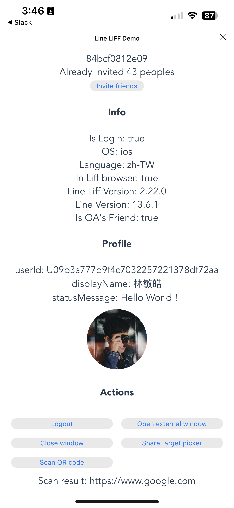

# Line Liff Demo

Demo URL：https://liff.line.me/1660790386-ez8vylrR

This is a web page designed for a viral marketing campaign on Line, a popular messaging app in Asia. The page is gamified and encourages users to share the campaign with their Line friends in order to increase its reach and engagement.

### Screenshots

  
  &nbsp; &nbsp;
  

The page consists of four sections:

1. Demo Campaign: Viral marketing-related content
2. Info: Displays basic information about the user's device, environment, app version, and whether the official account has been added
3. Profile: Shows the user's data, including their ID, name, photo, and status
4. Actions: Offers a selection of useful actions, such as sharing, opening external links, and scanning QR codes

### How To Join Campaign

1. Click the "Invite friends" button to share your invitation code with your friends. When they click on your link, they will see that they were invited by you. They can then invite their own friends to continue the viral marketing effect.
2. This page also displays who invited you, your invitation code, and the number of people you have invited.
3. For testing purposes, you can invite yourself by clicking on the link with your own invitation code.

### References

- Line Front-end Framework (LIFF): https://developers.line.biz/en/docs/liff/overview/
